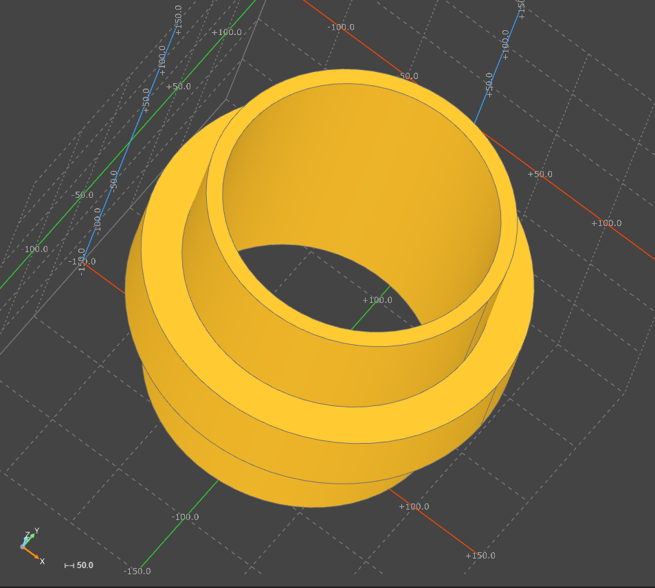

# Делаю переходник для вентиляции гаража, дабы соединить современные блага в виде оцинкованных 100 труб с советским наследием в виде ржавых металлических 100 труб
#### С кодом можно ознакомиться [тут](adapter.py)
