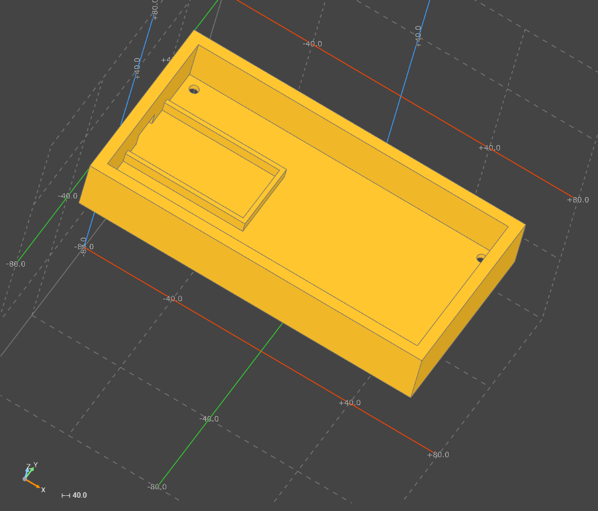
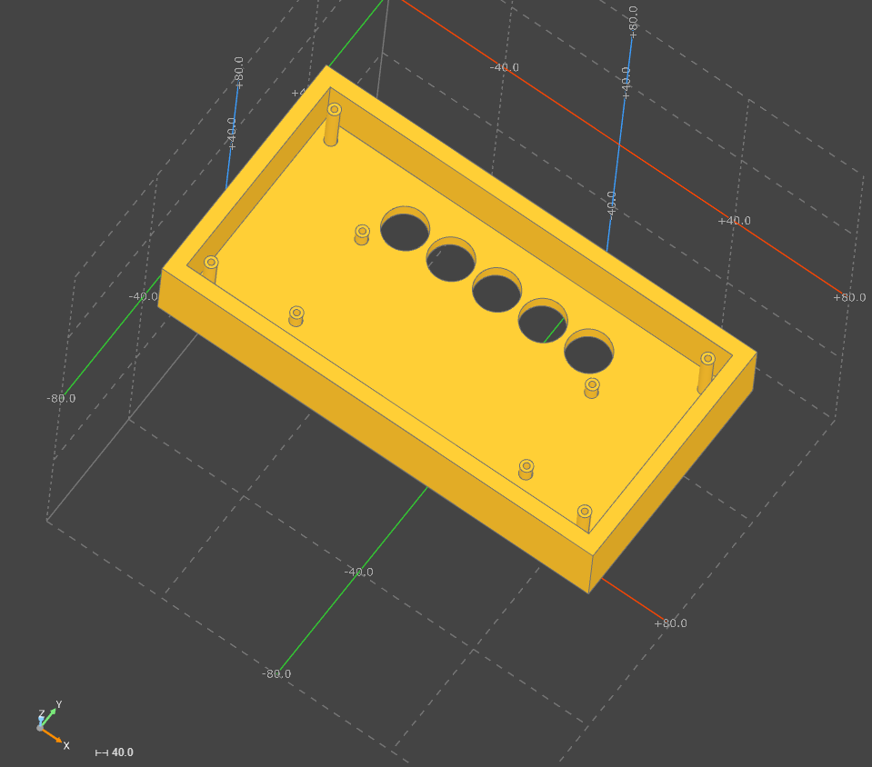

# Создал корпус с помощью кода через Build123 для ламповых часов
## Корпус состоит из двух частей, верхней и нижней
- С кодом можно ознакомиться в файлах 

    [Код верхней части](./top_case.py)

    [Код нижней части](./bottom_case.py)
## Нижняя часть

## Верхняя часть
